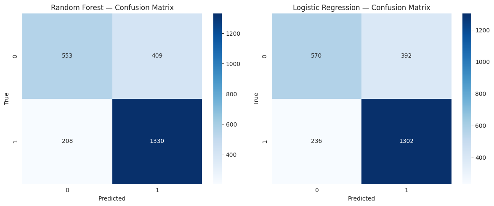
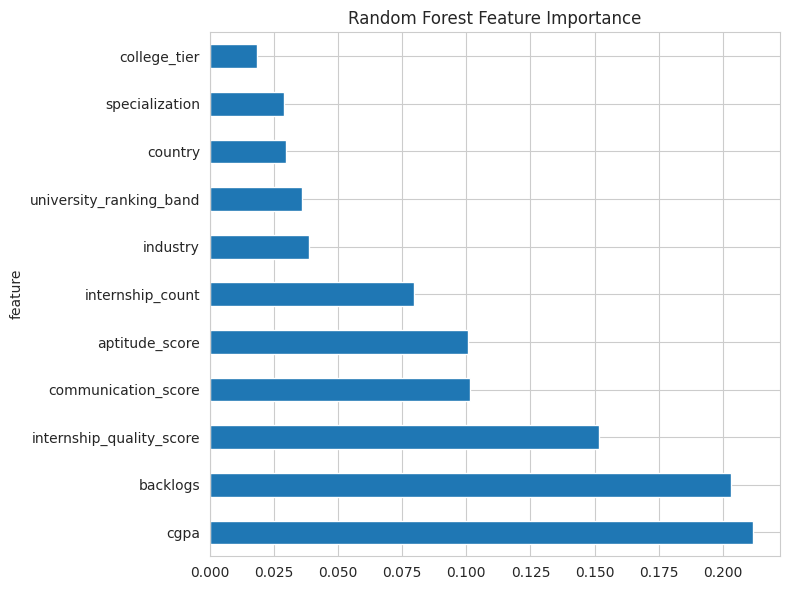

# Machine Learning Analysis Report  
## Student Placement Prediction
### Werner Kruger

---

## Overview

This project addresses a **supervised classification** problem: predicting whether a student will be placed (e.g., receive a job offer) based on academic and demographic features. The dataset used is the **Global Student Placement 2025 Dataset** (Kaggle: [rakesh630/global-student-placement-2025-dataset](https://www.kaggle.com/datasets/rakesh630/global-student-placement-2025-dataset)). A binary or multiclass classification workflow was implemented in a Jupyter notebook using **scikit-learn**, with **Random Forest** and **Logistic Regression** as the primary models, and performance evaluated using accuracy, precision, recall, and F1-score.

---

## Dataset Description

The Global Student Placement 2025 dataset represents student records intended for placement-outcome analysis. The dataset includes **10,002 rows** and **13 columns**. Features include: **cgpa**, **backlogs**, **college_tier**, **country**, **university_ranking_band**, **internship_count**, **aptitude_score**, **communication_score**, **specialization**, **industry**, **internship_quality_score**, and **salary**. The **target variable** is **placement_status** (Placed / Not Placed). Key features used for modeling include all predictors above (excluding salary if used only as an outcome); categorical variables (e.g., college_tier, country, specialization, industry) were label-encoded and numeric features were standardized before training.

---

## Modeling Approach

**Data preparation:** Missing values in the target were handled by dropping those rows; missing values in features were filled with the column median where applicable. Categorical variables were encoded using label encoding to obtain numeric inputs. Numeric features were standardized using **StandardScaler** (zero mean, unit variance) so that models sensitive to scale (e.g., logistic regression) are not dominated by features with larger ranges (Pedregosa et al., 2011). The data were split into train and test sets (e.g., 75% / 25%) with stratification when the target is categorical to preserve class proportions.

**Model selection:** **Random Forest** was chosen for its ability to capture non-linear relationships and interactions without extensive feature engineering, and for providing feature importance (Breiman, 2001). **Logistic Regression** was used as an interpretable baseline and is appropriate for binary or multiclass classification with probabilistic outputs (Hastie et al., 2009). Both are well-suited to tabular data with mixed feature types.

**Evaluation metrics:** For classification, **accuracy**, **precision**, **recall**, and **F1-score** (weighted for multiclass) were used. These metrics are standard for evaluating classifiers and align with placement prediction: we care both about correctly identifying placed students (recall) and avoiding false positives (precision), with F1 balancing the two (Sokolova & Lapalme, 2009). A **confusion matrix** was included to show per-class performance.

**Assumptions:** The model assumes that the training and test data are drawn from the same distribution, that missing-at-random or missingness in features can be reasonably handled by median imputation, and that label encoding of categorical variables is acceptable for tree-based and linear models in this context.

---

## Results

Model performance is summarized using test-set metrics and visualizations generated in the notebook. On the held-out test split, the **Random Forest** model achieved an accuracy of **0.7532** with a weighted F1-score of **0.7464**, while the **Logistic Regression** model achieved an accuracy of **0.7488** and weighted F1-score of **0.7438** 

- **Accuracy** reports the proportion of correctly classified students.
- **Precision (weighted)** and **Recall (weighted)** summarize class-weighted precision and recall across the Placed / Not Placed classes.
- **F1-score (weighted)** provides a single summary that balances precision and recall, accounting for class imbalance.

In the notebook, **Figure 1** shows the **confusion matrix** for the Random Forest model and **Figure 2** shows the confusion matrix for Logistic Regression, highlighting which classes the models confuse most often. **Figure 3** presents a horizontal bar chart of **Random Forest feature importances**, indicating which variables (e.g., cgpa, aptitude_score, internship_count, or communication_score) contribute most strongly to predicting placement status.

---

## Interpretation for a Non-Technical Audience

In plain terms: we used student information (grades, test scores, skills, etc.) to predict whether a student would get placed (e.g., receive a job offer). The models were trained on a portion of the data and then tested on a held-out portion to see how often their predictions matched the actual outcomes.

- **Accuracy** tells us what fraction of students were correctly predicted as placed or not placed.
- **Precision** and **recall** help us understand mistakes: for example, high recall for “Placed” means we rarely miss students who actually get placed; high precision means that when we predict “Placed,” we are usually right. The **F1-score** combines these into a single number that balances both concerns.

The **confusion matrix** shows how many students were correctly or incorrectly classified in each category. **Feature importance** from the Random Forest indicates which factors (e.g., grades or experience) the model relied on most when making predictions. Overall, the results show how well the model can distinguish between placed and not-placed students and which factors appear most associated with placement in this dataset.

---

## Limitations and Potential Bias

**Limitations:**  
- Model performance depends on the quality and completeness of the dataset; missing values were handled with simple imputation, which may not be appropriate if data are not missing at random.  
- The models assume that relationships in the training period hold for future cohorts; changes in job markets or recruitment practices could reduce real-world accuracy.  
- Evaluation is based on a single random train-test split; cross-validation would give a more stable estimate of performance but was not the main focus of this report.  
- Feature importance from Random Forest reflects association in the data, not causation, and can be influenced by correlated predictors.

**Potential bias:**  
- **Selection bias**: If the dataset over-represents certain institutions, regions, or demographics, the model may not generalize fairly to underrepresented groups.  
- **Label bias**: Placement status may be influenced by factors not in the data (e.g., networking, interview performance), so the model may reinforce or amplify existing inequalities present in the training data.  
- **Evaluation bias**: Optimizing for overall accuracy can hide poor performance on minority classes (e.g., placed vs not placed if one class is rare); reporting precision, recall, and F1 per class helps surface this.

**Responsible use:** To reduce risk, one step is to **audit performance by subgroup** (e.g., by gender or institution) and report metrics per group; if performance is systematically worse for some groups, the model should be refined or its use restricted until fairness and bias are addressed. Avoiding use of the model as the sole decision criterion for placement or recruitment is another important mitigation.

---

## References

Breiman, L. (2001). Random forests. *Machine Learning*, 45(1), 5–32.  
https://doi.org/10.1023/A:1010933404324

Hastie, T., Tibshirani, R., & Friedman, J. (2009). *The Elements of Statistical Learning: Data Mining, Inference, and Prediction* (2nd ed.). Springer.

Pedregosa, F., et al. (2011). Scikit-learn: Machine Learning in Python. *Journal of Machine Learning Research*, 12, 2825–2830.

Sokolova, M., & Lapalme, G. (2009). A systematic analysis of performance measures for classification tasks. *Information Processing & Management*, 45(4), 427–437.  
https://doi.org/10.1016/j.ipm.2009.03.002
